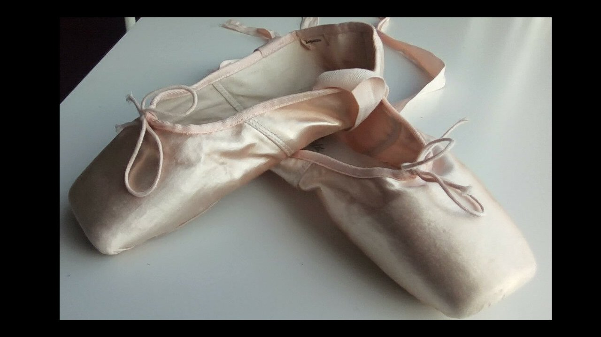
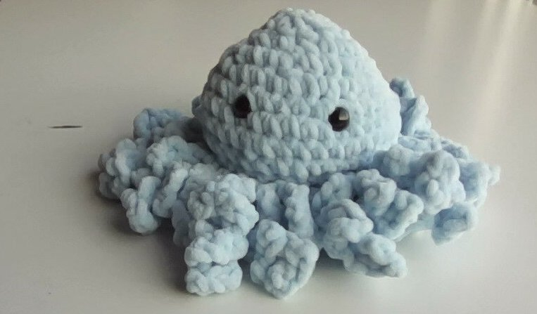
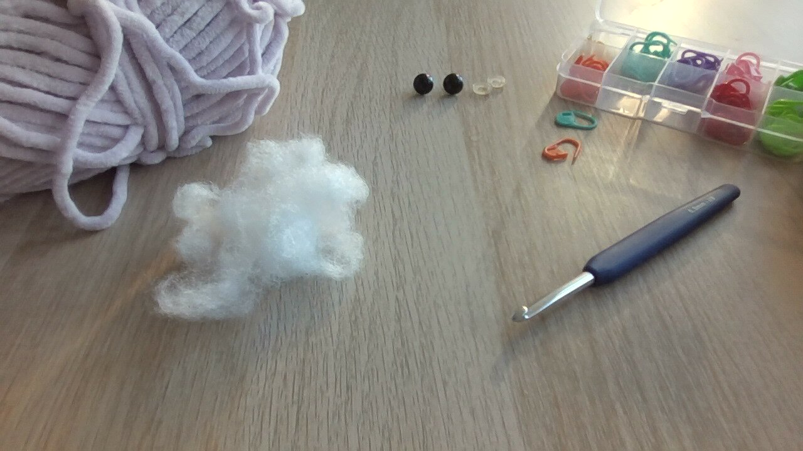
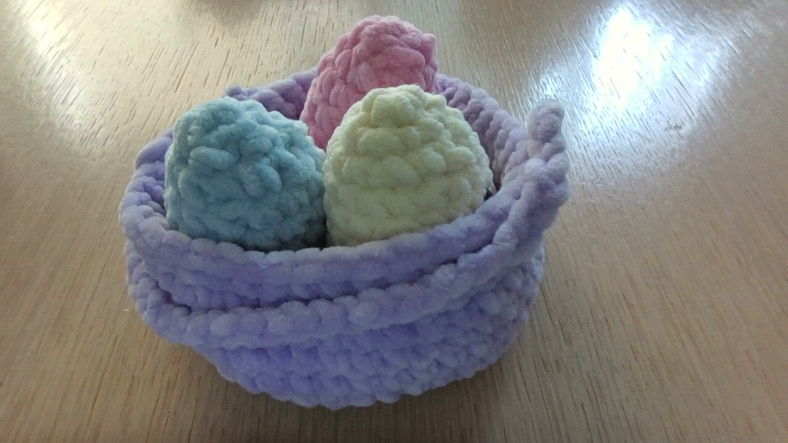

# bff
Coucou,bienvenue sur ma page internet!!!
Cette page vas parler de trucs MINIONS!!!
Si vous n aimez pas les truks minion sortez!!!

Une de mes meilleure pote m a appris a faire du crochet!!!(voici ma premiere oeuvre)

voici le materiel nescecaire:

## EXPLICATIONS POULPE:
cercle magique 8 mailles, 
un rang avec uniquement des augementations,
une maille serée une augmentation tout le tour,
deux mailles serées une augementation tout le tour,
5 rangs de mailles serées,
une diminution une maille serée tout le tour,
retourner la creation,
metre des yeux,
metre de marques mailles dans chaque brins interieure,
fair des tentacules,
## TENTACULES EXPLICATION:
fair une chainette de 33 mailles,
fair une maille serée dans chaques trois mailles,
fair ca tout le tour.

## FERMER:
Fair que des diminution tout le tour,
fair un noeud et l enfoncer.
## fini!!!

## petit test quelle "populaire" est tu?:

A l ecole,tout le monde regarde Zoe:
😀Tu es TRES jalouse.
🤟Tu t en fiches.
🐼Zoe c est toi!!!

Tout le monde adore le pantalon de lea:
😀Tu file t acheter le meme.
🤟Toi tu ne l aime pas particulierement.
🐼Toi aussis tout le monde te regarde,tu as le meme!!!

Tu doit presenter un exposee devant tout le monde:
😀Tu vas pouvoir montrer que tu fait mieux que cette peste de valentine!!!
🤟Tu n aime pas etre devant tout le monde...
🐼Cool tout le monde adore t ecouter!!!

## Max de 😀:
Tu n est pas assez "populaire" a ton gout,
alors tu te donne beaucoup de mal pour etre "cool"
mais qui a t il de geniale a etre populaire?
pose toi la question...

## Max de 🤟:
Tu n est pas populaire 
et tu ne fait rien pour l etre.
c est ok si ca te plait.

## Max de 🐼:
Tu es TRES populaire.
C cool mais fait attention a rester
cool avec tes amies,c est important.

## Crochet oeuf de paque

